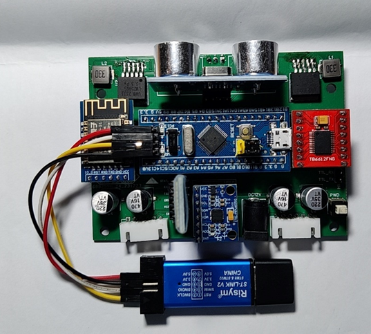

# two-wheeled-balance-car
## 简介
这是一项“两轮平衡小车”设计项目，内容包括单片机源代码，参数调试及遥控APP源码（Android），PCB设计图和实验报告。

设计题目来源于本科大四时期的专业综合设计课程。

本项目于2023年末完成，于2025年初开源，希望能为您提供参考。

受限于个人技术，项目还有很多改进之处，欢迎讨论，请多海涵。

## 1 题目简述
本次综合设计中的题目是“智能平衡小车设计”。本题目旨在应用电子元件和功能模块制作一款两轮自平衡小车，实现运动控制、通信、避障和循迹等功能。

该设计的基本要求包括：
-	小车采用单片机或嵌入式系统作为主控模块
-	小车采用两轮式驱动，能够自主保持平衡
-	小车可以通过蓝牙模块与手机通信，实现APP控制小车运行
-	小车运动速度可通过APP或按钮调整

该设计的拓展要求包括：
-	小车自主运行，遇到障碍物自动回避
-	通过WIFI模块控制小车运行
-	小车通过超声波模块检测前方障碍物距离并显示距离数值
-	小车通过红外对管实现在白底黑线背景下的自动巡线功能

## 2 实现方法
电子功能模块：
- STM32F103C8T6Mini主控板
- HC05蓝牙模块
- ATK-ESP8266WIFI模块
- MPU6050陀螺仪模块
- HCSR04超声波模块
- 红外避障模块
- 电机驱动模块等

平衡控制原理：PID算法

PCB设计与打板：力创EDA

APP开发：Android Platform（Java）

程序框架：

## 3 实物展示

## 4 APP界面
